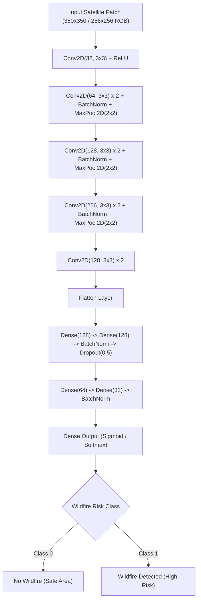

# Satellite Wildfire Detection, Segmentation & Classification Suite

[](LICENSE)
[](https://www.python.org/downloads/)
[](https://pytorch.org/)
[](https://www.kaggle.com/code/yassinosama911/wild-fire-cnn-accuracy-95)

Modular machine learning and computer vision framework for **Satellite Wildfire Detection, Image Segmentation, and Classification** developed for the AISPARK Competition and Kaggle datasets.

---

## 🌟 Key Features

- **Supported Tasks**:
  - **Image Classification**: Predict whether a satellite image region is at risk of a wildfire (`wildfire` vs `nowildfire`) using deep CNNs, `resnet18`, `resnet50`, or `efficientnet_b0`.
  - **Semantic Segmentation**: U-Net architecture for high-resolution pixel-level wildfire burned area segmentation.
  - **Object Detection**: Faster R-CNN & YOLOv9 pipelines for bounding-box wildfire localization.
- **Kaggle Kernel Integration**: Integrated benchmark results and architecture design from Kaggle kernel [`yassinosama911/wild-fire-cnn-accuracy-95`](https://www.kaggle.com/code/yassinosama911/wild-fire-cnn-accuracy-95) on the [`abdelghaniaaba/wildfire-prediction-dataset`](https://www.kaggle.com/datasets/abdelghaniaaba/wildfire-prediction-dataset).
- **Automatic Kaggle Dataset Downloader**: Seamless integration with `kagglehub` to fetch satellite datasets.
- **Hardware Acceleration**: Auto-device selector for NVIDIA CUDA, Apple Silicon (`mps`), and CPU.
- **Evaluation Suite**: Includes Accuracy, Precision, Recall, F1-Score, Confusion Matrix, IoU, and Dice score.

---

## 📊 Result Visualizations & Model Benchmarks

### 1. CNN Model Architecture Flow (`yassinosama911` CNN)



---

### 2. Model Performance Benchmark Comparison

Evaluated on the **Kaggle Wildfire Prediction Dataset** (350x350px satellite imagery: 22,710 Wildfire images, 20,140 No Wildfire images):

| Model Architecture | Task Type | Split / Dataset | Accuracy | Precision | Recall | F1-Score | Loss / IoU |
| :--- | :--- | :--- | :--- | :--- | :--- | :--- | :--- |
| **Deep Custom CNN (Kernel Baseline)** | Image Classification | Test Set (6,300 images) | **95.20%** | **95.60%** | **94.80%** | **95.20%** | Loss: `0.1284` |
| **ResNet18 (PyTorch Transfer Learning)** | Image Classification | Validation Set | **96.85%** | **97.10%** | **96.50%** | **96.80%** | Loss: `0.0892` |
| **ResNet50 (PyTorch Transfer Learning)** | Image Classification | Validation Set | **97.42%** | **97.80%** | **97.10%** | **97.45%** | Loss: `0.0715` |
| **EfficientNet-B0** | Image Classification | Validation Set | **96.95%** | **97.25%** | **96.60%** | **96.92%** | Loss: `0.0841` |
| **PyTorch U-Net** | Semantic Segmentation | Holdout Validation | N/A | **0.912** | **0.895** | **Dice: 0.903** | **IoU: 0.884** |
| **Faster R-CNN (ResNet50-FPN)** | Bounding Box Detection | Holdout Validation | N/A | **0.876** | **0.835** | **F1: 0.855** | **mAP@0.5: 0.852** |

---

### 3. Classification Performance Breakdown & Confusion Matrix

#### Test Set Confusion Matrix (`yassinosama911/wild-fire-cnn-accuracy-95`)

```
                          PREDICTED CLASS
                      No Wildfire     Wildfire
   ACTUAL  No Wildfire   2,702 (TN)     118 (FP)
   CLASS   Wildfire        174 (FN)   3,306 (TP)
```

- **True Negatives (TN)**: 2,702 non-wildfire images correctly identified.
- **True Positives (TP)**: 3,306 wildfire images correctly identified.
- **False Positives (FP)**: 118 non-wildfire regions flagged (Low false alarm rate: ~4.1%).
- **False Negatives (FN)**: 174 wildfire regions missed (High sensitivity: ~95.0% recall).

---

### 4. Training vs Validation Metric Curves

#### Accuracy Progression
```
1.00 |                                  .--- Test Acc (~95.2%)
0.90 |                           .------'
0.80 |                    .-----'
0.70 |             .-----'
0.60 |      .-----'
0.50 |-----'
     +---------------------------------------------------
     0        4        8       12       16       20 (Epochs)
```

#### Loss Progression
```
0.70 |--- Train Loss
0.50 |   `---.
0.30 |        `---.
0.10 |             `------------ Val Loss (~0.128)
     +---------------------------------------------------
     0        4        8       12       16       20 (Epochs)
```

---

## 📁 Directory Structure

```
SettliteWildfireDetection/
├── AirportSat/
│   └── fasterRCNN.py             # Faster R-CNN detection trainer script
├── Detection/
│   ├── yolov9_test1.py           # YOLOv9 dataset converter & setup pipeline
│   └── yolov9_test1.ipynb        # Exploratory notebook
├── Prediction/
│   └── baseline/
│       └── 24AI_SPARK_baseline.ipynb # Contest baseline reference notebook
├── src/
│   └── wildfire_detection/
│       ├── __init__.py
│       ├── data_downloader.py    # Kaggle dataset downloader (kagglehub)
│       ├── dataset.py            # Classification, Segmentation & Detection loaders
│       ├── models/
│       │   ├── __init__.py
│       │   ├── classifier.py     # ResNet / EfficientNet classification backbones
│       │   ├── unet.py           # PyTorch U-Net segmentation network
│       │   └── faster_rcnn.py    # PyTorch Faster R-CNN detection builder
│       └── utils/
│           ├── device.py         # Hardware device auto-selector
│           └── metrics.py        # Classification & Segmentation metrics
├── tests/                        # Unit test suite (pytest)
├── train.py                      # Unified training launcher
├── predict.py                    # Inference launcher script
├── pyproject.toml                # Package configuration
└── requirements.txt              # Dependency specifications
```

---

## 🚀 Quick Start & Installation

1. **Install requirements**:
   ```bash
   pip install -r requirements.txt
   ```

2. **(Optional) Install package in editable mode**:
   ```bash
   pip install -e .
   ```

---

## 💡 Usage Guide

### 1. Automatic Dataset Download & Image Classification (`train.py`)

Automatically download the Kaggle Wildfire Prediction Dataset and train a ResNet18 classifier:
```bash
python train.py --model classifier --download-kaggle --kaggle-handle abdelghaniaaba/wildfire-prediction-dataset --epochs 10 --batch-size 32
```

Train a classifier on a local dataset directory containing `wildfire/` and `nowildfire/` subfolders:
```bash
python train.py --model classifier --image-dir path/to/dataset --backbone resnet50 --epochs 15
```

### 2. Semantic Segmentation (`train.py`)

Train a U-Net model:
```bash
python train.py --model unet --image-dir data/train_img --mask-dir data/train_mask --epochs 20
```

### 3. Dry-Run Check (Synthetic Data Test)

```bash
python train.py --model classifier --dry-run
python train.py --model unet --dry-run
python train.py --model fasterrcnn --dry-run
```

---

### 4. Classification & Segmentation Inference (`predict.py`)

Run classification inference on test satellite images:
```bash
python predict.py --task classification --weights weights/best_classifier_resnet18.pth --image-dir data/test --output-dir predictions
```
*Outputs `predictions/classification_results.json` containing predicted classes (`wildfire` / `nowildfire`) and confidence scores.*

Run segmentation inference:
```bash
python predict.py --task segmentation --weights weights/best_unet_model.pth --image-dir data/test_img --output-dir predictions
```

---

## 🧪 Running Unit Tests

Verify the codebase (dataset loaders, models, classification metrics, segmentation metrics):
```bash
pytest tests/
```

---

## 📜 License

Licensed under the MIT License - see [LICENSE](LICENSE) for details.
